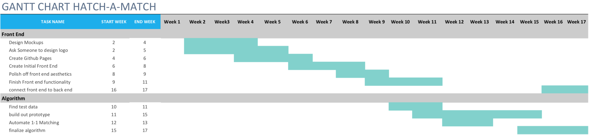

# 4.0 Software Development Plan

## Outline of Software Development Plan

##### 4.1 Plan Introduction

##### 4.1.1 Project Deliverables

##### 4.2 Project Resources

##### 4.2.1 Hardware Resources

##### 4.2.2 Software Resources

##### 4.3 Project Organization

##### 4.4 Project Schedule

##### 4.4.1 GANTT Chart

##### 4.4.2 Task/ Resource Table

### 4.1 Plan Introduction

This Software Development Plan provides the detail of the planned development for the Hatch-a-Match Web application which provides an application for users to match mentors and mentees in their organizations.

The Project will use a genetic algorithm to find a good matching of 'bigs' and 'littles' in on campus organizations that submit their prefernces for pairings. This project is designed to help reduce bias on behalf of organizers, as well as to provide a way to decrease the workload of such organizers. In development, the project will accomplish a final working app by early May of 2019.

#### 4.1.1 Project Deliverables

**Project Proposal Document										  Week 2**

The detail of the project proposal will be completed by week 2 of the semester.

**Requirements Specification Document Initial		Week 5**

The preliminary software requirements document will be completed by week 5 of the semester. This will include all of the requirements for the app.

**Software Test Plan Document									  Week 9**

The Software Test Plan will be delivered week 9 of the semester and will detail the different tests that need to be performed on the software.

**Software Development Plan Document					 Week 11**

The Software Development Plan will be delivered in week 11 of the semester, and will describe the process that will be used leading to the final project.

**Requirements Specification Document Final			Week 13**

The final Requirements will be delivered by Week 13 and will include any necessary changes.

**Preliminary Demonstration Presentations				Week 15**

The preliminary demonstration presentation will be delivered by week 15 and will include a powerpoint and demo.

**Final Product Delivery													  Week 17**

The final product will be delivered by week 17 and will include all of the necessary elements for running the app.

**Written Status Reports													  Weekly Throughout Semester**

Weekly status reports will be provided throughout the semester on the status of the application.

****

### 4.2 Project Resources

Resources involved in project development are organized into hardware and software resources. Within those categories, involvement in the development process and/or application execution is indicated.

#### 4.2.1 Hardware Resources

| Resource             | Development | Execution |
| -------------------- | ----------- | --------- |
| Macbook Pro Computer | X           |           |

#### 4.2.1 Software Resources

| Resource         | Application                                                | Development | Execution |
| ---------------- | ---------------------------------------------------------- | ----------- | --------- |
| Atom             | Text editor                                                | X           |           |
| JavaScript   | Programming Language        | X           | X         |
| HTML | Scripting Language | X | X |
| CSS | Style | X | X |
| GitHub     | Version Control | X          |           |
| Github Pages | Website Hosting |  | X |
| Google Chrome   | Web browser                  | X           | X |
| macOs           | Development operating system | X           |           |

### 4.3 Project Organization

This section will outline Hatch-a-Match project organization, including team member roles and team responsibility.

##### 4.3.1 Organization Structure

We have organized our project members into three teams: algorithm and front-end.

| Name           | Team      | Role                                          |
| -------------- | --------- | --------------------------------------------- |
| Haley Fletcher | Algorithm | Data analysis and matching algorithm creation |
| Haley Fletcher | Front-End | Front-end designer                            |

##### 4.3.2 Algorithm Team

The Algorithm team is responsible for designing, writing, and testing a genetic algorithm to find a good pairing for members in an organization that they have the rankings to.

##### 4.3.4 Front-End team

The Front-End team is responsible for designing and developing the interfaces between users and the algorithm itself.

##### 4.3.5 Roles and Responsibilities

As this project is a solo project, all of the roles and responsibilities fall on Haley Fletcher. She will not need communication paths because she and the professor are the only people she will be communicating with. She will fill the role of chief programmer as well as the role of front end designer, architect, back end design, and algorithm design.

### 4.4 Project Schedule

This section will detail the Hatch-a-Match project schedule including the people and resources necessary for each step.

#### 4.4.1 GANTT Chart

The following GANTT Chart visualizes the duration of the subtasks for Hatch-a-Match in relationship with each other.

#### 4.4.2 Task/Resources

| Task                       | People         | Hardware | Software              |
| -------------------------- | -------------- | -------- | --------------------- |
| Design Mockups             | Haley Fletcher | Macbook  | Canva                 |
| Ask someone to design logo | Jose Camacho   | N/A      | Illustrator           |
| Create Github Pages        | Haley Fletcher | Macbook  | Github Pages          |
| Build out Algorithm        | Haley Fletcher | Macbook  | Javascript            |
| Front End Development      | Haley Fletcher | Macbook  | Javascript, CSS, HTML |
